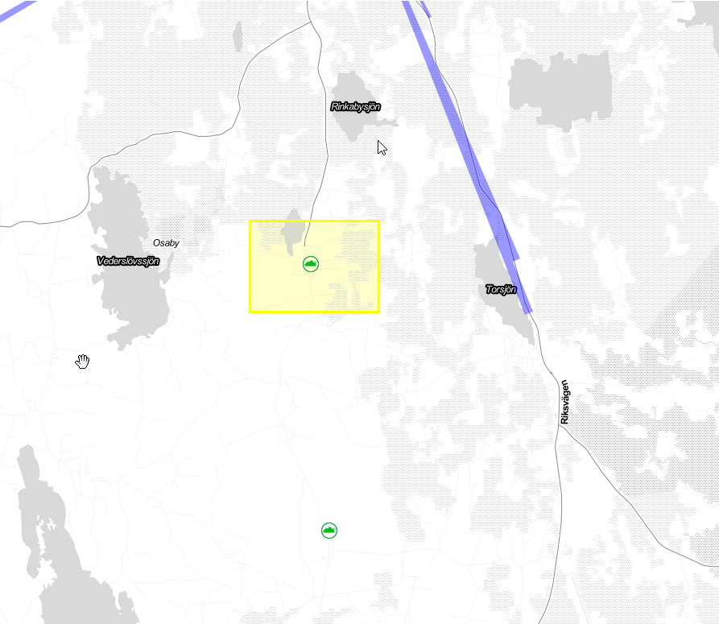

# The Things Network (TTN) @ your place

###### tags: `planning` `examination`
---
**Table of Contents**

[TOC]

### Problem definition

My first idea of this project was to build some smart device for the agricultural sector where a later could use the data for predicting the future using Machine Learning. This is probably the most straight forward idea, collect data and then analyze it which is a less technical aspect but more about valuation. However, the idea ends abrupt before I really start working with it, where I realize that covering 20 acres of agricultural landscape requires something else than an WiFi. So, in order to got it to work I needed an alternative bearer able to send data to a collector where I decided to got for the [LoRaWAN®](https://lora-alliance.org/about-lorawan/) (Long Range Wide Area Network) approach which seems to be well-balanced choice. 

Växjö Energi AB, VEAB, have a gateway for LoRaWAN® setup in the city area but the signal is not in sight where I live, 10 km away, so the project become a task to setup my own LoRaWAN® and evaluate the coverage per monetary unit (i e the amount of covered acres per SEK). To achieve such understanding I need to create a tool able to pick up the signal and measure it's strength and the device location and put this recording into a map which visualize these findings. Fortunately, there are a couple of community networks already having such features which allowed me to focus at the actual coverage and less at visualizing data. The choice fell at The Things Network (TTN) where the The Things Network Mapper application provided me with the visualization. Connecting to the TTN also allows me to work with The Things Stack (TTS) a back end stack which makes it possible to store and/or forward sensor data to other locations with both predefined but also custom made integrations where the above TTN Mapper is one of the predefined.    

TTN is a so called crowd sourced project where the punchline **bring your own gateway** represents the essence of the areas covered. In other words, if you don't have LoRaWAN® coverage at your location, setup your own gateway and share it with your neighborhood.	

### Objectives

Build a mobile TTN Mapper device to learn and understand the basics of how to build and operate a Internet of Things device and use the same for elaborate with coverage from a The Things Indoor Gateway (TTIG).

A mobile TTN Mapper device is probably not an per-year autonomous device, nor is it a device that need to support military accuracy when it comes to location, in my point of view a couple of meters would be fine as sit till gives you a relevant score for the coverage. This means that the objectives will down prioritize power consumption and exact position when the message was sent, or the time between a GPS read and sending the message through LoRaWAN®.  

To be honest, I bought an indoor gateway and hoped that if I put it close enough to a window I might be able to cover a couple of meters outside from the house ... but I was wrong.

### Material

You shouldn't need to bother by setting up your own gateway but my original problem was the lack of LoRaWAN® presence so to start working I need such a transport gateway. I bought a cheaper variant, the The Things Indoor Gateway (TTIG) for approximately EUR 80 (incl VAT), but there are plenty of other gateways you can use but this one comes with a automatic setup for TTNv3.

*When I first started I didn't realized that there is a new version (3) of the TTN where the simplified*
*Semtech UDP Packet Forwarder protocol has been abandoned something I realized as I first started to test with a cheaper (1-channel) gateway, the [Dragino LG01-N](https://www.dragino.com/products/lora-lorawan-gateway/item/117-lg01-p.html). I did manage to get this up and running but the lack of support in the TTS forced me to abandon this setup quite fast.*

Measure the coverage requires a sensor able to provide the device with GPS coordinates, where the *Pytrack* fit well together with the *Lopy4* micro controller, the combination would end up in a very neat and slim hardware configuration. I also invested some money in the LoRaWAN® and GPS antenna to ensure that both the GPS as well as the LoRaWAN® coverage measure would not depend on the TTN Mapper but rather the gateway itself.

Below you can find a list of the required hardware I used for the project and from where I order them.

| Component | Capabilities | Price (incl VAT, excl freight) | Vendor link |
| --------- | ---------------- | ---------| ------- |
| [Pycom Lopy4](https://pycom.io/product/lopy4/)   | Microcontroller | SEK 480 | [Digikey](https://www.digikey.se/products/sv?keywords=lopy4) |
| [Pytrack 2.0.x Expansion board](https://pycom.io/product/pytrack-2-0-x/)  | GPS | SEK 460 | [Mouser](https://www.mouser.se/ProductDetail/Pycom/604565286017?qs=sGAEpiMZZMv0NwlthflBi98X9085w8V%252BtWaXU%252BemDPA%3D) |
| Pycom LoRa/Sigfox antenna | Send/receive | SEK 180 | [Digikey](https://www.digikey.se/product-detail/sv/pycom-ltd/SIGFOX-LORA-ANTENNA-KIT/1871-1005-ND/7721843) |
| External GPS antenna  | Increased GPS receiver | SEK 225 | [Mouser](https://www.mouser.se/ProductDetail/Pycom/604565430465?qs=sGAEpiMZZMv0NwlthflBi%252BaVk7F50MhHRCD37BDS1ng%3D) |
| [The Things Indoor Gateway](https://connectedthings.store/gb/lorawan-gateways/indoor-lorawan-gateways/the-things-indoor-gateway-868-mhz.html) | LoRaWAN® gateway | SEK 750 | [RS-Components](https://se.rs-online.com/web/p/communication-wireless-development-tools/2018876) |

At the time, some components where hard to find and as the idea of the project shifted I had to purchase material from 
several vendors, however the freight cost from *Mouser* was zero (0) for orders exceeding SEK 500 so an additional GPS antenna
make that one free of charge. You should also have in mind that most of the vendors have a Swedish website but they are
located outside EU (except *RS-Components*) which means that you have to be aware of taxes required when importing this.


### Environment setup

The development environment I've used is *[atom.io](https://atom.io/)* with the *[Pymakr](https://docs.pycom.io/gettingstarted/software/atom/)* plugin which worked very well with the selected hardware. 

Setting up the environment is a straight forward task and instructions can be found here. However, if you like me, 
doesn't read the instructions in details you might find the error from *atom.io* hard to understand as they aren't always 
complaining about the actual problems but rather wrap it in some other mysterious error message. There is already excellent guidelines for how to setup your environment regardless of which *Expansion Board* you are using. However, I also had to update the firmware for *Pytrack 2.0.x* which has its own guide and should be a prerequisite in order to get it up running.    

[Guide - Update shield firmware](https://docs.pycom.io/updatefirmware/expansionboard/) 

[Guide - Setup environment on you computer](https://hackmd.io/hMq4hSCJRIiwoeD2YKeILQ)

The installation of the Indoor gateway is a straight forward task, where I first registered an account at The Things Network. From there I opened up the Console and selected the cluster node **Europe 1** and then claim my newly purchased gateway. Claiming basically means configure and make it available. 

[Guide - Claim your TTSv3 Gateway](https://www.thethingsindustries.com/docs/gateways/gateway-claiming/claim-gateways/)


>
>Fig 1, registered/claimed gateways displayed in the TTS Console


As you can see I've two registered gateways, the TTIG and the previously mentioned 1-channel *Dragino LG01-N*. 
The difference is the cluster association where the older one can't be registered for the Europe 1 cluster but only 
"Other cluster" which is a dumpster for obsolete gateways (in this case a UDP package forwarder), still usable but very 
limited in TTSv3. 

Once claimed I expect it to appear in the [ttnmapper.org](https://ttnmapper.org/) map as a connected but without coverage data gateway. 
We are now public and open for business.

>
>Fig 2, Gateway visible at the ttnmapper.org

We also need to setup our device in TTS, where TTS refers to them as application. Regardless of the naming you can find an excellent guide how to configure, setup and start using a device i TTS below. From this guide you should remember the Device EUI (used for searching in the TTN Mapper) and the Application Key (AppKey) which you need when joining (setting up a session) your device.

[Guide - Setup a device in TTS](https://hackmd.io/@lnu-iot/rkWOVue6_)

### Putting everything together

The TTN mapper is a neat task to put together where wiring the antenna is the only externals that has to be attached 
to the *Lopy4* resp. *Pytrack* expansion shield. As I previously mentioned the *Lopy4* and *Pytrack* is a very compound unit easy to encapsulate and therefor as an experiment easy make mobile. Mobility is the key for this kind of device otherwise we would not gain much when it comes to measure LoRaWAN® coverage.

>
>Fig 3, the Lopy4 mounted at a Pytrack 2.0.X


One should know that building a TTN mapper by yourself is more about having fun than filling a gap in the market.
With that in mind you might also consider [cheaper hardware](https://sensebox.de/projects/en/2020-03-06-ttn-mapper) and perhaps focus on a high power usage efficiency but the *Pycom* parts has good documentation and with the *Pymakr* plugin I would say that I'm happy with using these components.

The device design is simple but we need to consider how to power the device and reasoning about the power source itself. 
Using a deep sleep approach to preserve battery requires us to wait before getting coordinates as the GPS locator required 1 - 2 minutes to be accurate. So, why did we then choose the *Pytrack* at all? The reason is simple, this is the nature of the GPS itself so regardless if we are using the *Pytrack* or any other disintegrated GPS c we need to wait for it after it is powered up. With *Pytrack* we also don't need an shield, like the *Expansion Board 3.1* with an external sensor attached through wire so the *Pytrack* is quite cheap even though the GPS capability itself could be found slight cheaper. 

So what about the power consumption?

To achieve a lot of coverage data we would probably need to travel by some kind of vehicle, preferably a car or something. This means that we also most certainly can power the device from the cars cigarette outlet by a simple USB cable. Even though if we would change our preferred way to travel around using a bicycle we could use the same connector (USB) and power the device with a power bank, in my case a very cheap one (6700 mAh) bought years ago at *Clas Ohlsson*. The sensor would also most certainly return to home every day so a long lived autonomous device would not be necessary. 

Finally, the GPS sensor is quite sensitive when it comes to locating satellites, if you like me, sitting at the office you would appreciate an external GPS antenna which allows you to sit inside and still being able to have GPS access as long as you have a window where your antenna body could be placed. Attaching the antenna listed above is "a-cannot-do-it-wrong-task" where an active antenna need have a jumper attached, connecting the two pins highlighted in the picture below. The *Pytrack* is shipped without this jumper so you need to borrow it from elsewhere.

>
>Fig 4, Pytrack active antenna jumper setting 

### Platforms and infrastructure

The problem definition states that we need LoRaWAN® coverage at the countryside but also that we should share it with others so using a TTIG for this project is a no-brainer, especially as many of the vendors have such gateway in stock. TTIG is also naturally connected with the TTN so using The Things Stack (TTS) as backend is more about using what we already have.

TTS is about to connect data using some standard communication or storage solution which makes it generic when it comes to connecting a device with an application. You can think of TTS as a middleware or service bus where you got access to many predefined configurations, *MQTT*, *Webhooks* but also vendor specific integrations for *Azure IoT Hub* and *AWS IoT* just to mention some. 

For this project we need to connect it to the TTN Mapper application designated to store coverage metrics contributed by idealists (and perhaps one or two commercial actors) in a true crowd sourcing spirit. So, the overall setup is quite simple, the device connects to a gateway and establish a session with the backend using the device *EUI* and an application key, the backend then processes each incoming requests from the device by formatting and forward it to the TTN mapper application. 

>
>Fig 5, information flow from device to application

The information contract provided by the TTN mapper requires **Latitude** and **Longitude** together with **at least one quality measure** to get accepted by the TTN Mapper. These attributes needs to be committed by the device and in our case we accept them in the TTSv3 and transformed the provided bytes to a *JSON* format payload using a TTN formatter, applied before transmitting the final payload to TTN Mapper. The transformer source can be find below in the code section. 

Once done with the payload transformation we can enable the TTN Mapper integration by using a predefined webhook, this webhook uses default settings to build up the configuration where the recommendation is to add an "experiment" header when you start up your transmission. "Experiments" can be used for testing your device and can be search for in the TTN mapper web but will not appear in the public map. So, tuning you device before removing the experiment name is recommended. 

The public community network uses a "fair use policy" which limits the **airtime to 30 seconds every 24 hours per node** (or device) which is a small number and might not be useful for all devices. It also limits the number of downlink messages to **10/day and node**. During the elaboration I used more than 30 seconds and day to test how it was reacting to an consumption exceeding the "fair use policy" but it seems like it is based on trust rather than an enforcing policy as all packages went through. 


### The code

Typically you setup connectivity in the `boot.py` but I had hard times to light up the *Lopy4* RGB LED from there instead I placed all logic in the `main.py` file. I use the *Lopy4* RGB LED as a indicator easy to spot when operating in the field. 

First we try to join with the LoRaWAN®, but as we probably aren't always in range for a gateway we shouldn't avoid being stupid allow the loop continue forever, instead we retry 20 times and then take a break in our attempt to join. Once joined we indicate this by turning on the yellow color at the RGB LED which means we are open for business. 

```python
lora.join(activation=LoRa.OTAA, auth=(app_eui, app_key), timeout=0)

for x in range(20):
    if not lora.has_joined():
        print('Not joined yet...attempt ', (x+1))
        time.sleep(2.5)

if not lora.has_joined():
    print('Could not join network, will try again later')
    machine.deepsleep(60000);
else:
    print('Network joined!')

 # Yellow while checking satellites
pycom.rgbled(0xFFFF00)
```

The business logic is kept in a loop where we fetch and send **coordinates**, **satellites** and **hdop** as bytes over LoRaWAN®. We ignore the numbers if the a quality is poor, i e the **hdop** value is less than 2 (according to the TTN Mapper documentation [FAQ](https://docs.ttnmapper.org/FAQ.html)). With the default *Pycom* drivers for *Pytrack* only coordinates were accessible so I needed another driver which could read and expose all the required satellites data from the [NMEA-formatted](https://www.gpsworld.com/what-exactly-is-gps-nmea-data/) payload. Fortunately I found one matching these requirements at the [andreathemac@GitHub](https://github.com/andrethemac/L76GLNSV4) repository 

For each iteration in the loop, we make a GPS reading (`l76` is the object representing the GPS) and check the quality before emitting an event to the gateway with the collected GPS values. During this process we visualize the progress with the RGB LED where

- Blue is "waiting"
- Green is "sending" 
- Red indicates a "GPS accuracy problem", which typically happens the first 2 - 3 iterations while the GPS is fixating the satellites or if you're inside without any window nearby 

The idea with the visuals is that it should be easy to confirm that the device is working and its current state. So, blue light with green blips every 30 seconds signals a working device 

```python
while (True):

    # Check if the GPS is awake and have a reading
    if l76.fixed() :

        # Read values one by one and convert them to floats
        # Could be more efficient by reading them all at the same time
        # as these might causing the double-taps at smaller intervals between reads
        lat = float(l76.gps_message('GGA',debug=False)['Latitude'])
        long = float(l76.gps_message('GGA',debug=False)['Longitude'])
        sv = float(l76.gps_message('GGA',debug=False)['NumberOfSV'])
        hdop = float(l76.gps_message('GGA',debug=False)['HDOP'])

        # Make sure we have a valid reading and that the quality is good enough
        # for the mapper integration, otherwise we should not spend any airtime
        if hdop is not None and hdop < 2.0:

            # Open socket only if GPS is fixed and with a correct reading with high quality
            s = socket.socket(socket.AF_LORA, socket.SOCK_RAW)

            try:
                s.setsockopt(socket.SOL_LORA, socket.SO_DR, 5)
                s.setblocking(False)

                # Payload size is 16 bytes (4*4) but can be optimized by omitting the sv (-4 bytes) or convert
                # sv to an unsigned integer (-2 bytes but requires additional logic at recipient transformation)
                s.send(struct.pack('<10f',lat,long,sv,hdop))

            finally:
                # Close socket as we are done here
                s.close()

            # Signal success, blue light
            pycom.rgbled(0x0000FF)
        else:
            # Red light means waiting for GPS or quality is poor
            pycom.rgbled(0xFF0000)
    else :
        # Red light means waiting for GPS
        pycom.rgbled(0xFF0000)

    # Sleep 30 seconds before retrying
    time.sleep(30)

    # Green light lit to indicate next transmit window
    pycom.rgbled(0x00FF00)
```

During elaboration I made two separate project very similar to each other, one referred to as the [continuous on](https://github.com/erlandsson-tavelsas/iot-lnu/tree/main/source/Mapper%20-%20Always%20on) and the other as [deep sleep/awake](https://github.com/erlandsson-tavelsas/iot-lnu/tree/main/source/Mapper)

The deep sleep/awake version is better suited for autonomous operations like being placed in a car and wake up every X minutes and do its job. To avoid unnecessary start up time for the GPS, which takes 1 - 2 minutes to get accurate readings, there is a feature where you can put the machine in deep sleep but preserve the *Pytrack* GPS powered. This is more or less the only difference between the two projects and could be summarized by these two line of code. 

```python
# Keep the GPS powered up even though the machine is in deepsleep, this will result
# a faster "fix" and keep satellites "in sight"
pytrack.go_to_sleep(gps=True)
machine.deepsleep(60000) # Sleep for 1 minute
```

### The physical network layer

The problem definition at first was how you could connect multiple devices for agricultural measures spread across 20 acres or more where some long range bearer was needed.  The lack of such bearer made me shifting focus and use some kind of self-service approach i e bring your own network and try to it as cheap as possible. So both LoRaWAN® and Sigfox would have been candidates but the first seems to have a better public available documentation than Sigfox. It also might have been influenced by previous classes of the course where there were a lot of samples connecting with LoRaWAN®. 

For the mapper device I started with the idea of a 1 minute execution cycle where the device was put in deep sleep between the send windows. The *Pygate* can be kept awake while the machine is into deep sleep which saves time when it wakes up. The GPS will need 1 - 2 minutes before having a so called "fix" at the satellites. Sending a message every 6 minute would have cost us 1 second airtime each hour (~0.1 seconds for each message) which allows us to have the device continuously reporting 24/7. The complete source for this "machine deep sleep/ GPS keep awake" configuration could be found in the [source catalog](https://github.com/erlandsson-tavelsas/iot-lnu/tree/main/source/Mapper).

Depending on the speed you are traveling with there might be a potential problem with a minor discrepancy between the GPS readings and the payload transmission, I also find it a little bit boring waiting for the wake up call and therefor made some adjustments to better fit a pedestrian carrier. In this scenario I never put the machine into deep sleep unless it couldn't find a LoRaWAN® network to join. Instead we keep the session (joined) open and pumping events every X seconds. 

Starting with 10 seconds it allows us to rapidly create a pretty fine grained view over the coverage for my gateway. Sending a message every 10 seconds consumes 0.6 seconds airtime every minute which allows us to map for only 50 minutes a day, a 4 km walk. With this configuration I noticed that we got "double-taps" or paired readings close to each other but still with a 10 seconds difference in time. This symptom is probably caused by some kind of timing problem how the code uses the library or maybe the library itself, where GPS reads will eventually be *slight* stale at the time when data is requested from the driver. **I haven't figured out this yet** but when I elaborated with the interval and set it to every 30 seconds it seems like the mapper device became well-balanced when walking, so I consider this as a **work around** for now. The increased interval also allows us to use it for a longer period, approximately 150 minutes a day or a 12 km walk at the same time as the double-taps disappeared, a win-win situation.

>
>Fig 6, Yellow boxes 10 seconds, Green 30 seconds


The payload itself is kept at a (almost) bare minimum of 16 bytes, describing 4 float values, **longitude**, **latitude**, **hdop** and **number of visible satellites** **(sv)**. 
There are still some optimization possible regarding passing number of satellites as an unsigned integer instead of a float. The number of satellites is also not mandatory as long as we have the **hdop** value, but I decided to keep it for now regardless. Our device has both a power source and was not intended to be autonomous for longer than a day so I decided to spare complexity at the transformation at the server-side rather than save those 2 or 4 extra bytes while transmitting. 

```python
# Payload size is 16 bytes (4*4) but can be optimized by omitting the sv (-4 bytes) or convert
# sv to an unsigned integer (-2 bytes but requires additional logic at recipient transformation)
s.send(struct.pack('<10f',lat,long,sv,hdop))
```

In the TTS console we can then easily pick up and transform the message by the built-in `javascript` formatter utility, one would notice that I've hardwired the altitude but this is on purpose as we most of time holding the device a meter above ground so we don't need to send this information in every request from the device. Defining a formatter in the TTS console could be done from Applications section, selecting Payload formatters and then Uplink (incoming requests transformation).

```javascript
function decodeUplink(input) {
  function bytesToFloat(bytes) {
    var bits = bytes[3] << 24 | bytes[2] << 16 | bytes[1] << 8 | bytes[0];
    var sign = (bits >>> 31 === 0) ? 1.0 : -1.0;
    var e = bits >>> 23 & 0xff;
    var m = (e === 0) ? (bits & 0x7fffff) << 1 : (bits & 0x7fffff) | 0x800000;
    var f = sign * m * Math.pow(2, e - 150);
    return f;
  }
  
  return {
    data: {
      latitude : bytesToFloat(input.bytes.slice(0,4)),
      longitude : bytesToFloat(input.bytes.slice(4,8)),
      sats : bytesToFloat(input.bytes.slice(8,12)),
      hdop : bytesToFloat(input.bytes.slice(12)),
      altitude : 1
    },
    warnings: [],
    errors: []
  };
}
```


### Visualization and user interface

The Things Stack (TTS) comes with a predefined *Webhook* for integrating with TTN Mapper application and it can also be found below the Application section (1) and Integrations (2) where you can find the template when you create a Webhook (3). 

>
>Fig 7, register TTN Mapper Webhook


Note, you can set an experimental name (4) which allows you to publish these values without promoting them to the public coverage map, very useful if you, let's say mixing up longitude and latitude values which is very common where I live ;)

When you finally start mapping coverage you will see that everything works as expected by watching the Live data stream for the device (or application). You should see a stream of events with the type "Forward uplink data message" containing a *JSON* payload with the transformed values that we have recorded 

>
>Fig 8, uplink message log for the TTN mapper device


The visualization in the [TTN Mapper](https://ttnmapper.org/) application is immediately available if you search for it directly using device EUI, gateway or experiment name in tab [Advanced maps](https://ttnmapper.org/advanced-maps/), where the search result could be visualized in a [map](https://ttnmapper.org/devices/?device=eui-70b3d5499eca445d&startdate=&enddate=&gateways=on&lines=on&points=on) or exported as a [csv](https://ttnmapper.org/devices/csv-pg.php?device=eui-70b3d5499eca445d&startdate=&enddate=&gateways=on&lines=on&points=on) data set. 

### Conclusions

With a couple of mapping sessions, trying to cover the the same distance from north, south, east and west directions away from the gateway, I stunningly realized that the indoor gateway exceeded my expectations by far concerning range. Picking up points at each direction gives me an average of at least 400 meters with the highest signal strength which means it will easily cover `400 * 400 * 3,14 ~= 500000 square meters` equals to 50 ha or 100 acres. Within this range I also tested the **join capability** a couple of times where it successfully manage to join the network from the outer distances at 400 meters. This means that within this range it would be possible to place a sensor using deep sleep and wake up, join and then send data through the gateway without any network accessibility problem.

>
>Fig 9, the covered area and measure locations, red = high, blue = low

The total cost for the network coverage is **SEK 7,50/acre**, which means that bringing your own LoRaWAN® network to the farm wouldn't be an financial issue as the sensors themselves way exceeds the network connectivity costs. From the project setup, there are still a couple of concerns that needs to be addressed.

First, setting up a gateway for professional use is probably better done with an outdoor gateway with a constant power supply compared to an indoor ditto plugged in into a random power outlet. Mounted at a high place and with an external antenna it will also extends the range multiple times and provide a more reliable access to LoRaWAN®. Still affordable, with a list price between [SEK 4000 - 6000](https://connectedthings.store/gb/lorawan-gateways/outdoor-lorawan-gateways/), the outdoor gateway will cover at least 500 acres (yes, such linear approximation is stupid) but probably more for the same cost/acre. 

For agricultural sensors the covered area would more or less targeting open landscapes, without any hard obstacle that might interfere with the signals. This assumption applies to smaller farms. However, many of the farms today typically have a mixed business model including both agricultural as well as forestry operations where the latter might be a bigger challenge when it comes to create network presence for Internet of Things. The same things applies to the open landscapes at a scattered property which could not be covered by a single gateway but has to be applied over several gateways, I believe this is were the crowd source aspects would matter. 

#### If I had more time then I would have...

* ... bought an outdoor gateway with antenna and performed the same measures to understand the problem better
* ... tested Sigfox connectivity using the same approach to see if a commercial network has a better coverage
* ... tested with a passive external GPS antenna with a better "mobility-first" design/form factor
* ... elaborated with obstacles and degradations, i e how buildings, kind of forests, slopes, hills etc affects the signal  
* ... fixed the device's physical packaging with a wake up/deep sleep configuration and placed 3 or 4 of them on the companies fleet of vehicles for at least 1 month where they autonomous could collecting data in Växjö and surroundings 

